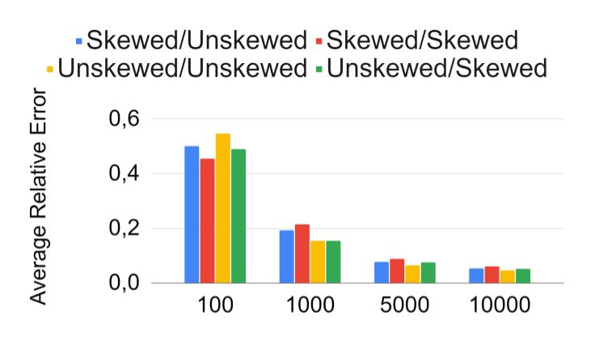
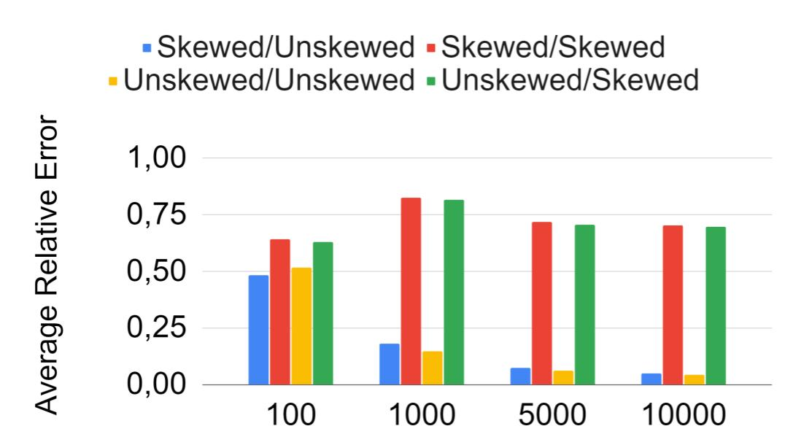
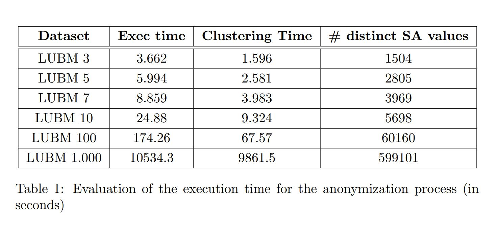

# Knowledge Graph Anonymization using Semantic Anatomization

The goal of is this repo is to provide complementary information for our paper "Knowledge Graph Anonymization using Semantic Anatomization" submitted to the 7th International Workshop on Privacy and Security of Big Data.

## Directory "queries"
It contains the different queries mentionned in the article:
* *query_inital_cluster* corresponds to the query referenced in section 4.3 allowing us to retrieve the initial clusters used in our algorithm
* *query_update* corresponds to the query referenced in section 4.5 allowing us to insert intermediary nodes between the EoIs and the SAs.

## Algorithm
Here we provide the pseudo-code for the algorithm described in section 2.

## Religion ontology

This is the 4-level hierarchy we used to extend our LUBM datasets

## Evaluation

We provide the effectiveness results presented in the paper in section 6
We also added the results of our comparison with a state-of-the art suppression-based technique.
Finally, we present several tables summarizing the execution times of our approach with complementary results computed from smaller datasets.

### Effectiveness to anwser counting queries

Two attributes / One sensitive attribute

Two attributes / Two sensitive attributes

Three attributes / One sensitive attribute

Three attributes / Two sensitive attributes

Four attributes / One sensitive attribute

Four attributes / Two sensitive attributes

### Comparison with a suppression technique: Query-based linked data anonymization by Delanaux et al.

2 attributes

3 attributes

4 attributes

In a generalization/suppression context, we can only assume a uniform distribution for the values of the sensitives attributes. Hence, in the above-figures, we can see that the technique performs well when the values are indeed uniformly distributed but fails to provide satisfiable results otherwise.

### Execution times

*HasReligion* predicate

*Advisor* predicate

Since our approach is primarily dependent on the number of distinct values for the SA rather than the size of the graph, we observe constant and relatively low execution times for the *hasReligion* predicate.

On the other hand, tho objects for the *advisor* predicate being professor nodes, the number of distinct values grows with the size of the graph thus the execution times grow as well.